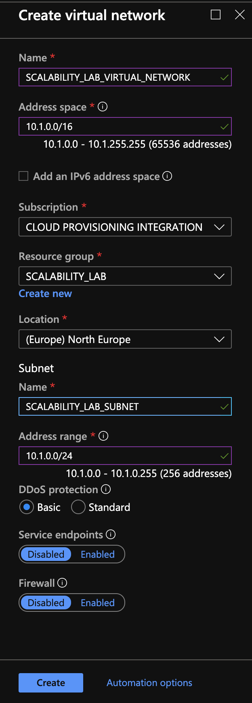

### Escuela Colombiana de Ingeniería
### Arquitecturas de Software - ARSW


### Julián David Gutiérrez Vanegas
### Andrés Ricardo Martínez Díaz


## Escalamiento en Azure con Maquinas Virtuales, Sacale Sets y Service Plans

### Dependencias
* Cree una cuenta gratuita dentro de Azure. Para hacerlo puede guiarse de esta [documentación](https://azure.microsoft.com/en-us/free/search/?&ef_id=Cj0KCQiA2ITuBRDkARIsAMK9Q7MuvuTqIfK15LWfaM7bLL_QsBbC5XhJJezUbcfx-qAnfPjH568chTMaAkAsEALw_wcB:G:s&OCID=AID2000068_SEM_alOkB9ZE&MarinID=alOkB9ZE_368060503322_%2Bazure_b_c__79187603991_kwd-23159435208&lnkd=Google_Azure_Brand&dclid=CjgKEAiA2ITuBRDchty8lqPlzS4SJAC3x4k1mAxU7XNhWdOSESfffUnMNjLWcAIuikQnj3C4U8xRG_D_BwE). Al hacerlo usted contará con $200 USD para gastar durante 1 mes.

### Parte 0 - Entendiendo el escenario de calidad

Adjunto a este laboratorio usted podrá encontrar una aplicación totalmente desarrollada que tiene como objetivo calcular el enésimo valor de la secuencia de Fibonnaci.

**Escalabilidad**
Cuando un conjunto de usuarios consulta un enésimo número (superior a 1000000) de la secuencia de Fibonacci de forma concurrente y el sistema se encuentra bajo condiciones normales de operación, todas las peticiones deben ser respondidas y el consumo de CPU del sistema no puede superar el 70%.

### Parte 1 - Escalabilidad vertical

1. Diríjase a el [Portal de Azure](https://portal.azure.com/) y a continuación cree una maquina virtual con las características básicas descritas en la imágen 1 y que corresponden a las siguientes:
    * Resource Group = SCALABILITY_LAB
    * Virtual machine name = VERTICAL-SCALABILITY
    * Image = Ubuntu Server 
    * Size = Standard B1ls
    * Username = scalability_lab
    * SSH publi key = Su llave ssh publica


2. Para conectarse a la VM use el siguiente comando, donde las `x` las debe remplazar por la IP de su propia VM.

    `ssh scalability_lab@xxx.xxx.xxx.xxx`

3. Instale node, para ello siga la sección *Installing Node.js and npm using NVM* que encontrará en este [enlace](https://linuxize.com/post/how-to-install-node-js-on-ubuntu-18.04/).
4. Para instalar la aplicación adjunta al Laboratorio, suba la carpeta `FibonacciApp` a un repositorio al cual tenga acceso y ejecute estos comandos dentro de la VM:

    `git clone <your_repo>`

    `cd <your_repo>/FibonacciApp`

    `npm install`

5. Para ejecutar la aplicación puede usar el comando `npm FibinacciApp.js`, sin embargo una vez pierda la conexión ssh la aplicación dejará de funcionar. Para evitar ese compartamiento usaremos *forever*. Ejecute los siguientes comando dentro de la VM.

    `npm install forever -g`

    `forever start FibinacciApp.js`

6. Antes de verificar si el endpoint funciona, en Azure vaya a la sección de *Networking* y cree una *Inbound port rule* tal como se muestra en la imágen. Para verificar que la aplicación funciona, use un browser y user el endpoint `http://xxx.xxx.xxx.xxx:3000/fibonacci/6`. La respuesta debe ser `The answer is 8`.


7. La función que calcula en enésimo número de la secuencia de Fibonacci está muy mal construido y consume bastante CPU para obtener la respuesta. Usando la consola del Browser documente los tiempos de respuesta para dicho endpoint usando los siguintes valores:
    * 1000000
    * 1010000
    * 1020000
    * 1030000
    * 1040000
    * 1050000
    * 1060000
    * 1070000
    * 1080000
    * 1090000    

8. Dírijase ahora a Azure y verifique el consumo de CPU para la VM. (Los resultados pueden tardar 5 minutos en aparecer).


9. Ahora usaremos Postman para simular una carga concurrente a nuestro sistema. Siga estos pasos.
    * Instale newman con el comando `npm install newman -g`. Para conocer más de Newman consulte el siguiente [enlace](https://learning.getpostman.com/docs/postman/collection-runs/command-line-integration-with-newman/).
    * Diríjase hasta la ruta `FibonacciApp/postman` en una maquina diferente a la VM.
    * Para el archivo `[ARSW_LOAD-BALANCING_AZURE].postman_environment.json` cambie el valor del parámetro `VM1` para que coincida con la IP de su VM.
    * Ejecute el siguiente comando.

    ```
    newman run ARSW_LOAD-BALANCING_AZURE.postman_collection.json -e [ARSW_LOAD-BALANCING_AZURE].postman_environment.json -n 10 &
    newman run ARSW_LOAD-BALANCING_AZURE.postman_collection.json -e [ARSW_LOAD-BALANCING_AZURE].postman_environment.json -n 10
    ```

10. La cantidad de CPU consumida es bastante grande y un conjunto considerable de peticiones concurrentes pueden hacer fallar nuestro servicio. Para solucionarlo usaremos una estrategia de Escalamiento Vertical. En Azure diríjase a la sección *size* y a continuación seleccione el tamaño `B2ms`.


11. Una vez el cambio se vea reflejado, repita el paso 7, 8 y 9.
12. Evalue el escenario de calidad asociado al requerimiento no funcional de escalabilidad y concluya si usando este modelo de escalabilidad logramos cumplirlo.
13. Vuelva a dejar la VM en el tamaño inicial para evitar cobros adicionales.

**Preguntas**


1. ¿Cuántos y cuáles recursos crea Azure junto con la VM?
	
	7 Incluyendo la VM 
	- Una red virtual.
	- Una cuenta de almacenamiento.
	- Una dirección ip pública.
	- Un grupo de seguridad.
	- Una interfaz de red.
	- Un disco
	

2. ¿Brevemente describa para qué sirve cada recurso?
	- Red virtual: Permite que el servidor en la red envíe y reciba datos de forma segura entre usuarios, con Internet y con las redes locales.
	- Cuenta de almacenamiento: Una cuenta de Azure Storage contiene todos los objetos de datos de Azure Storage: blobs, archivos, colas, tablas y discos. 
	- Dirección ip pública: Es la dirección que tiene la maquina virtual por la que se puede acceder a los servicios a través de internet.
	- Grupo de seguridad: Contiene reglas de seguridad que permiten o deniegan el tráfico de red entrante o el tráfico de red saliente de varios tipos de recursos de Azure.
	- Interfaz de red: interfaz de red generada por defecto al crear la maquina virtual, permite conectarse a la red.
	- Disco: Disco virtualizado de la maquina virtual, sirve para definir el tamaño y tipo de almacenamiento de la maquina.

3. ¿Al cerrar la conexión ssh con la VM, por qué se cae la aplicación que ejecutamos con el comando `npm FibonacciApp.js`? ¿Por qué debemos crear un *Inbound port rule* antes de acceder al servicio?

    Porque al cerrar la conexión tambien cerramos la ejecución del proceso que empieza el comando `npm FibonacciApp.js`. en cambio `forever start FibinacciApp.js` se encarga de estar ejecutando el proceso siempre.

    Hay que crearlo porque el servicio esta configurado para escuchar en el puerto 3000, entonces se crea el *Inbound port rule* para que se pueda acceder desde afuera del sistema a la aplicación.

4. Adjunte tabla de tiempos e interprete por qué la función tarda tando tiempo.

    Tiempos D1
    | Caso  | Tiempo  | 
    |-------|---------|
    | 1000000 | 40.12 s |
    | 1010000 | 41.44 s |
    | 1020000 |	42.81 s |
    | 1030000 | 42.53 s |
    | 1040000 | 45.10 s |
    | 1050000 | 45.91 s |
    | 1060000 |	46.25 s |
    | 1070000 |	46.97 s |
    | 1080000 |	47.84 s |
    | 1090000 |	48.61 s |

    Tiempos D2

    | Caso  | Tiempo  | 
    |-------|---------|
    | 1000000 | 39.36 s |
    | 1010000 | 40.96 s |
    | 1020000 |	42.36 s |
    | 1030000 | 41.98 s |
    | 1040000 | 43.79 s |
    | 1050000 | 45.05 s |
    | 1060000 |	45.46 s |
    | 1070000 |	46.23 s |
    | 1080000 |	46.01 s |
    | 1090000 |	45.88 s |

    La función tarda tanto es porque no guarda resultados después de consultar, osea que cada vez que consulte un número de la sucesión se volveran a calcular todos los anteriores así se hayan calculado antes. 

5. Adjunte imágen del consumo de CPU de la VM e interprete por qué la función consume esa cantidad de CPU.

    CPU D1
    

    CPU D2
    

    La función consume esa cantidad de CPU porque como no posee algún tipo de cache o memorización y calcula un solo valor por iteración siempre tiene que estar calculando números hasta encontrar el valor en la sucesión del número pedido, si este número es muy grande entonces hará más cálculos y consumirá más CPU.

6. Adjunte la imagen del resumen de la ejecución de Postman. Interprete:
    * Tiempos de ejecución de cada petición.
    * Si hubo fallos documentelos y explique.

    

    


7. ¿Cuál es la diferencia entre los tamaños `D2` y `D1` (no solo busque especificaciones de infraestructura)?

    D2 - Dos vCPU, 7 GiB de RAM, 8 discos de datos, 100 GiB de almacenamiento temporal y con un costo de $112.42.
    D1 - Una vCPU, 3.5 GiB de RAM, 4 discos de datos, 50 GiB de almacenamiento temporal y con un costo de $56.21.

    Basicamente el tamaño D2 duplica todas las especificaciones del D1 y cuesta el doble. 
    
8. ¿Aumentar el tamaño de la VM es una buena solución en este escenario?, ¿Qué pasa con la FibonacciApp cuando cambiamos el tamaño de la VM?

    Al aumentar la capacidad de la maquina se disminuye el tiempo que le toma calcular un número de la serie de Fibonacci pero a la larga no es una buena opción porque no se garantiza que siempre el tiempo al calcular sea reducido.

9. ¿Qué pasa con la infraestructura cuando cambia el tamaño de la VM? ¿Qué efectos negativos implica?

    Aunque el rendimiento y el tiempo mejorá un poco, no se justifica pagar el doble por una pequeña mejora en el tiempo de respuesta.

10. ¿Hubo mejora en el consumo de CPU o en los tiempos de respuesta? Si/No ¿Por qué?

    Como ahora tiene el doble de CPU y de RAM la carga en la CPU en proporción en menor de 85% a 43% aproximadamente, los tiempos del proceso mejoran debido al aumento de la RAM.

11. Aumente la cantidad de ejecuciones paralelas del comando de postman a `4`. ¿El comportamiento del sistema es porcentualmente mejor?


### Parte 2 - Escalabilidad horizontal

#### Crear el Balanceador de Carga

Antes de continuar puede eliminar el grupo de recursos anterior para evitar gastos adicionales y realizar la actividad en un grupo de recursos totalmente limpio.

1. El Balanceador de Carga es un recurso fundamental para habilitar la escalabilidad horizontal de nuestro sistema, por eso en este paso cree un balanceador de carga dentro de Azure tal cual como se muestra en la imágen adjunta.


2. A continuación cree un *Backend Pool*, guiese con la siguiente imágen.


3. A continuación cree un *Health Probe*, guiese con la siguiente imágen.


4. A continuación cree un *Load Balancing Rule*, guiese con la siguiente imágen.


5. Cree una *Virtual Network* dentro del grupo de recursos, guiese con la siguiente imágen.



#### Crear las maquinas virtuales (Nodos)

Ahora vamos a crear 3 VMs (VM1, VM2 y VM3) con direcciones IP públicas standar en 3 diferentes zonas de disponibilidad. Después las agregaremos al balanceador de carga.

1. En la configuración básica de la VM guíese por la siguiente imágen. Es importante que se fije en la "Avaiability Zone", donde la VM1 será 1, la VM2 será 2 y la VM3 será 3.


2. En la configuración de networking, verifique que se ha seleccionado la *Virtual Network*  y la *Subnet* creadas anteriormente. Adicionalmente asigne una IP pública y no olvide habilitar la redundancia de zona.


3. Para el Network Security Group seleccione "avanzado" y realice la siguiente configuración. No olvide crear un *Inbound Rule*, en el cual habilite el tráfico por el puerto 3000. Cuando cree la VM2 y la VM3, no necesita volver a crear el *Network Security Group*, sino que puede seleccionar el anteriormente creado.


4. Ahora asignaremos esta VM a nuestro balanceador de carga, para ello siga la configuración de la siguiente imágen.


5. Finalmente debemos instalar la aplicación de Fibonacci en la VM. para ello puede ejecutar el conjunto de los siguientes comandos, cambiando el nombre de la VM por el correcto

```
git clone https://github.com/daprieto1/ARSW_LOAD-BALANCING_AZURE.git

curl -o- https://raw.githubusercontent.com/creationix/nvm/v0.34.0/install.sh | bash
source /home/vm1/.bashrc
nvm install node

cd ARSW_LOAD-BALANCING_AZURE/FibonacciApp
npm install

npm install forever -g
forever start FibonacciApp.js
```

Realice este proceso para las 3 VMs, por ahora lo haremos a mano una por una, sin embargo es importante que usted sepa que existen herramientas para aumatizar este proceso, entre ellas encontramos Azure Resource Manager, OsDisk Images, Terraform con Vagrant y Paker, Puppet, Ansible entre otras.

#### Probar el resultado final de nuestra infraestructura

1. Porsupuesto el endpoint de acceso a nuestro sistema será la IP pública del balanceador de carga, primero verifiquemos que los servicios básicos están funcionando, consuma los siguientes recursos:

```
http://52.155.223.248/
http://52.155.223.248/fibonacci/1
```

2. Realice las pruebas de carga con `newman` que se realizaron en la parte 1 y haga un informe comparativo donde contraste: tiempos de respuesta, cantidad de peticiones respondidas con éxito, costos de las 2 infraestrucruras, es decir, la que desarrollamos con balanceo de carga horizontal y la que se hizo con una maquina virtual escalada.

3. Agregue una 4 maquina virtual y realice las pruebas de newman, pero esta vez no lance 2 peticiones en paralelo, sino que incrementelo a 4. Haga un informe donde presente el comportamiento de la CPU de las 4 VM y explique porque la tasa de éxito de las peticiones aumento con este estilo de escalabilidad.

```
newman run ARSW_LOAD-BALANCING_AZURE.postman_collection.json -e [ARSW_LOAD-BALANCING_AZURE].postman_environment.json -n 10 &
newman run ARSW_LOAD-BALANCING_AZURE.postman_collection.json -e [ARSW_LOAD-BALANCING_AZURE].postman_environment.json -n 10 &
newman run ARSW_LOAD-BALANCING_AZURE.postman_collection.json -e [ARSW_LOAD-BALANCING_AZURE].postman_environment.json -n 10 &
newman run ARSW_LOAD-BALANCING_AZURE.postman_collection.json -e [ARSW_LOAD-BALANCING_AZURE].postman_environment.json -n 10
```

**Preguntas**

* ¿Cuáles son los tipos de balanceadores de carga en Azure y en qué se diferencian?, ¿Qué es SKU, qué tipos hay y en qué se diferencian?, ¿Por qué el balanceador de carga necesita una IP pública?
 	- Existen dos tipos de balanceadores: públicos y privados. El balanceador público es aquel que permite conexiones salientes 	desde máquinas virtuales dentro de una misma red virtual, esto se logra mediante la traducción de ip's privadas a públicas. Por otro lado, el balanceador privado es aquel que se usa dentro de una misma red virtual para balancear el tráfico dentro de ella.
	 - Un SKU es un item que puede ser adquirido debajo de un producto. Existen los sku básicos y estandar. Estos dos difieren entre escalas de escenario, features y precios.
	 - Necesita de una dirección pública para poder ser accedido de manera remota
* ¿Cuál es el propósito del *Backend Pool*?
	- Son grupos de máquinas vituales que tienen como proposito atender las solicitudes entrantes. 
* ¿Cuál es el propósito del *Health Probe*?
	- Determinar el estado actual de las diferentes máquinas que componen el Backend Pool. Estas pruebas son realizadas por el balanceado de carga, y en caso de que la prueba falle en una máquina, el balanceador de carga dejará de remitir solicitudes a dicho balanceador
* ¿Cuál es el propósito de la *Load Balancing Rule*? ¿Qué tipos de sesión persistente existen, por qué esto es importante y cómo puede afectar la escalabilidad del sistema?.
	- Estas reglas buscan definir cómo se va a distribuir la carga entre las distintas máquinas que componen el Backend Pool.
	- 
* ¿Qué es una *Virtual Network*? ¿Qué es una *Subnet*? ¿Para qué sirven los *address space* y *address range*?
	- Una virtual network es una red que permite que diferentes recursos de Azure, como las máquinas virtuales, comunicarse de manera segura entre ellas mismas, Internet u otras redes On-Premise. 
	- Es un mecanismo que permita la segmentación de una red virtual en diferentes subredes. 
	- El "address range" sirve para configurar el rango de IP's, públicas o privadas, que se le asignan a los equipos de una red virtual.
	- El "address space" sirve para definir los distintos "adress range" que tendrá la red virtual. Estos no pueden solaparse entre ellos. 
* ¿Qué son las *Availability Zone* y por qué seleccionamos 3 diferentes zonas?. ¿Qué significa que una IP sea *zone-redundant*?
	- Las Availability Zones son espacios físicos únicos que contienen uno o más datacenters equipados con energía, refrigeración y redes independientes.
	- Se seleccionan 3 distintas zonas para garantizar una alta disponibilidad, ya que en caso de que una de las zonas elegidas presente complicaciones que le impidan estar disponible en un espacio de tiempo, la aplicación seguirá estando disponible gracias a las otras dos zonas.
	- Significa que está máquina se replica automaticamente en distintos equipos de distintas zonas.
	
* ¿Cuál es el propósito del *Network Security Group*?
	- Albergar una serie de reglas de seguridad de redes qud permiten o restringen el tráfico de salida o entrada de distintos recursos Azure. Estas reglas están compuestas por: un nombre, direcciones, puertos, prioridad, protocolos y la acción a realizarse (permitir o restringir).
* Informe de newman 1 (Punto 2)
* Presente el Diagrama de Despliegue de la solución.


